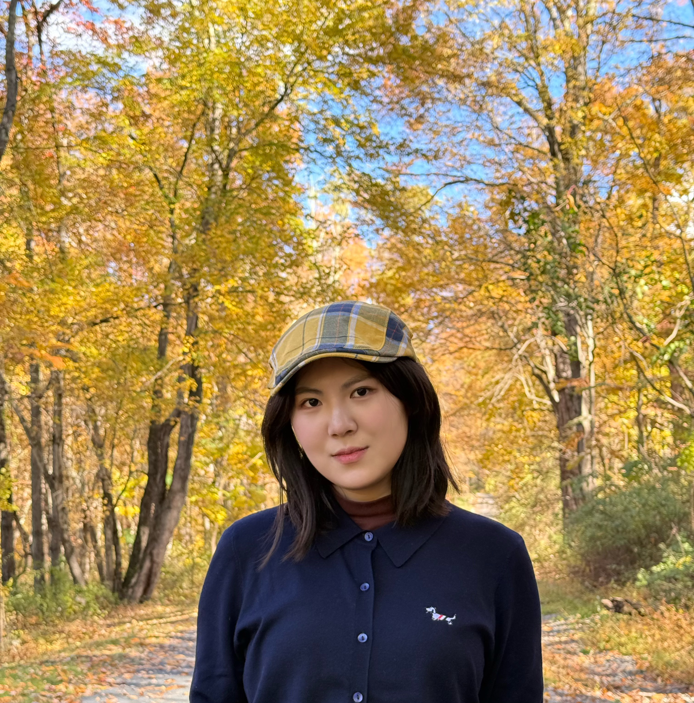

# Welcome to my website!

# Introduction
Hi, I'm Linqi Chu👋! I'm a first-year Master's student in Biostatistics (Data Science Track) at Columbia University, with a strong foundation in statistical modeling, machine learning, and causal inference.

I love working at the intersection of statistics and technology — whether it's applying causal discovery algorithms to Alzheimer's research, building LSTM models for weather prediction, or conducting A/B tests to optimize user experiences. My technical toolkit includes Python, R, SQL, and frameworks like TensorFlow, alongside expertise in experimental design and causal inference methods.

Currently, I'm exploring advanced topics in deep learning and AI agent while seeking opportunities to apply my skills in impactful, data-driven projects.

Let's connect: chulinqi42@gmail.com

# About Me

Click on the link to learn more about me!
[About Me](About.html)

# Visualization Dashboard

Here is a dashboard I made myself!
[Dashboard](dashboard.html)
